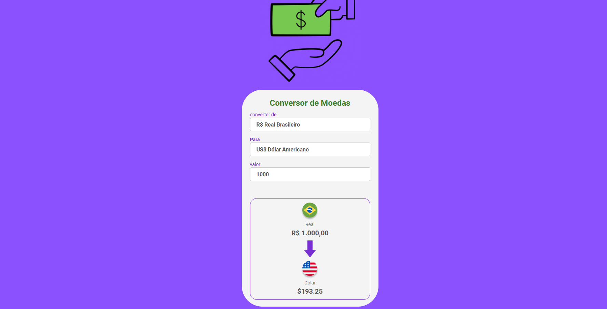

Projeto de conversor de moedas feito com HTML, CSS e JavaScript puro.

🔗 Acesse o projeto
[👉 Clique aqui para ver o site no ar](https://paiva-90.github.io/ProjetoConversor/)

💻 Tecnologias
- HTML5
- CSS3
- JavaScript

📱 Preview

---
Feito por Paiva-90